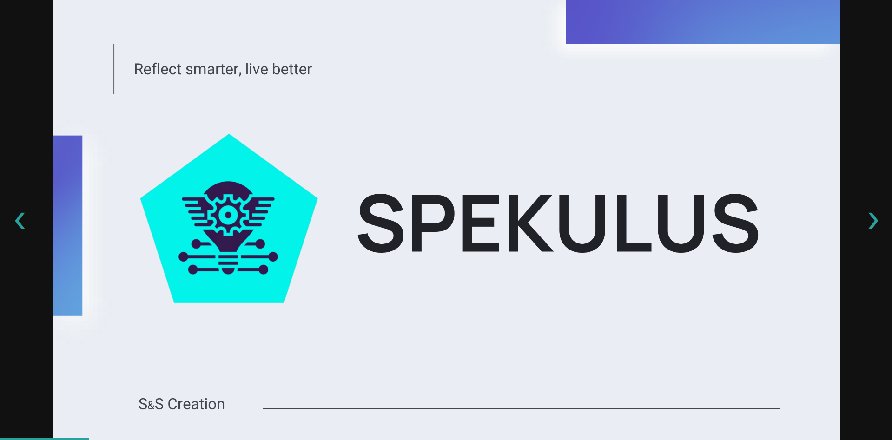
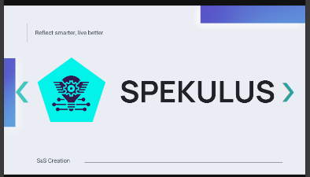

#  Spekulus Presentation 

Welcome to the official pitch presentation for **S & S Creation**! 🚀  

---

## 📸 Screenshots

| Desktop | Mobile |
|--------|--------|
|  |  |


---

## ✨ Features

- 🎞️ **Slide viewer** with keyboard, mouse & swipe support
- 🔄 **Auto-slide** every 10 seconds
- 🎯 **Smooth transitions** (fade in/out animation)
- 🖱️ **Scroll-to-slide** using mouse wheel
- 📱 **Touch swipe support** (mobile-friendly)
- 🧭 **Clickable navigation arrows**
- 🌊 **Turquoise themed UI**
- 📊 **Console tracking** for slide analytics
- 🖥️ **Fullscreen mode** (`F` to enter, `Esc` to exit)
- 📬 **Clickable contact info** on last slide (email, phone, portfolio)

---

## 🚀 How to Run

1. Clone this repository:
   ```bash
   git clone https://github.com/Antot-12/Spekulus-presentation.git
